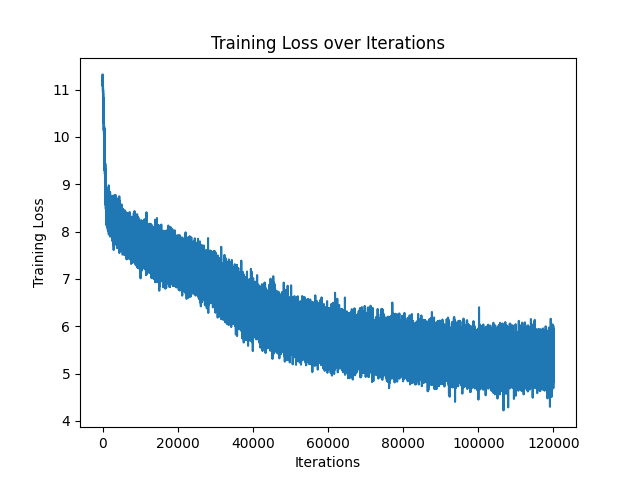

# 🧠 BERT from Scratch (PyTorch)

This project implements **BERT (Bidirectional Encoder Representations from Transformers)** from scratch using **PyTorch**, trained on a subset of Wikipedia data (approx. 15%). It includes the full pipeline:

- **Tokenizer** training (SentencePiece).
- **Pretraining tasks**: Masked Language Modeling (MLM) and Next Sentence Prediction (NSP).
- **Model architecture**: Custom implementation of BERT encoder layers.
- **Training loop** with AdamW + linear warmup + decay.
- **Checkpoint saving/loading** for resuming training or running inference.
- **Evaluation** on custom sentences with MLM + NSP tests.

---

## 📊 Training Progress

During pretraining, the **training loss** started high (~11.5) and steadily decreased to ~4.5–6.0 after ~120k iterations.  
While the graph is **noisy**, the overall **trend is downward**, indicating that the model is indeed learning.



🔍 **Observation:**  
The loss curve shows a lot of noise, which may indicate:
- Smaller batch sizes.
- Learning rate fluctuations.
- High variance in masked token prediction difficulty.

➡️ Improvements to try:
- Gradient accumulation for larger effective batch size.  
- Smoother learning rate schedules (cosine decay instead of linear).  
- More careful masking (not masking too many or too few tokens).  
- Training for longer on more data.

---

## ✅ Evaluation Results

After training, we tested **Masked Language Modeling (MLM)** and **Next Sentence Prediction (NSP)**.

### 🔹 Masked Language Modeling (MLM)

Given sentences with random masks, the model predicts missing tokens:

Example:  
```
Input: The capital of France is [MASK] and it is known as the city of lights.
Prediction: "the", ".", ","
```

While not always semantically perfect, predictions are **plausible tokens** that show the model has learned meaningful word distributions.

Other examples included:
- Correct guesses for context words like "of", "19", "century".
- Incorrect but still language-like guesses (".", ")", "of").

---

### 🔹 Next Sentence Prediction (NSP)

The model distinguishes whether two sentences are consecutive:

- **Correct pairings (IsNext):**
  - *"The sky is blue."* + *"Grass is green."* → 99.7%  
  - *"The capital of Japan is Tokyo."* + *"Mount Fuji is the highest mountain in Japan."* → 95.1%

- **Unrelated pairings (NotNext):**
  - *"Cats are small domesticated animals."* + *"The Eiffel Tower is located in Paris."* → 99.9% NotNext  
  - *"The sky is blue."* + *"I love pizza."* → Still gave 90.9% IsNext (❗ needs improvement)

➡️ Takeaway: NSP is working well but still confuses some unrelated sentences.

---


## 🚀 Key Learnings

- Training BERT from scratch is feasible even on a smaller dataset (15% of Wikipedia).  
- MLM works but needs **longer training** for fluent token predictions.  
- NSP is strong, though some cases confuse the model (could refine negatives).  
- Loss curve shows learning but is noisy → optimization improvements are possible.

---

## 🔮 Future Work

- Train longer on more data.  
- Use dynamic masking (instead of fixed UNK-based masking).  
- Replace NSP with **SOP (Sentence Order Prediction)** as done in ALBERT.  
- Experiment with larger batch sizes + better LR schedulers.  
- Fine-tune on downstream tasks (e.g., text classification, QA).
