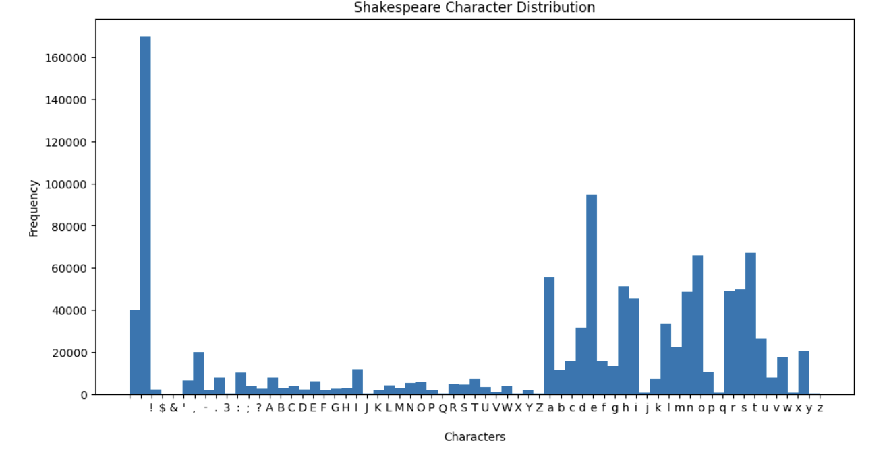
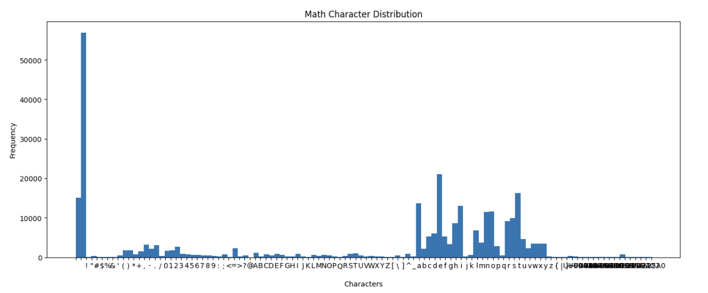
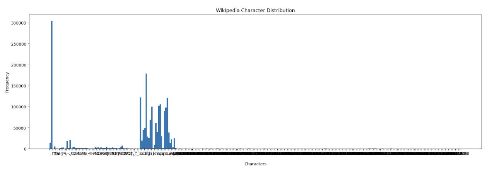
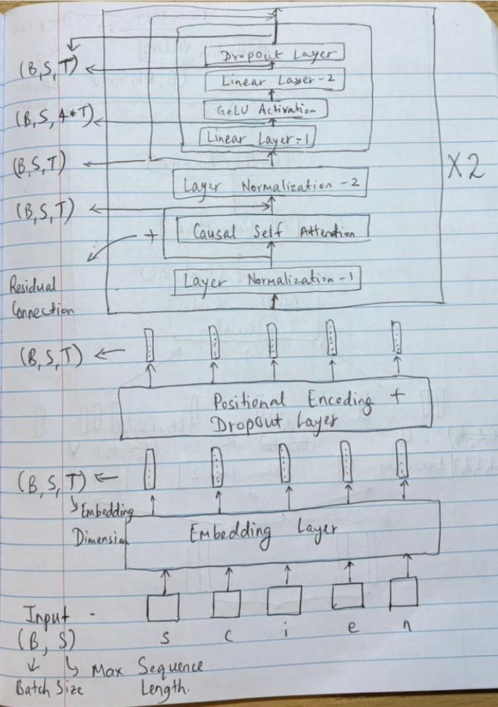
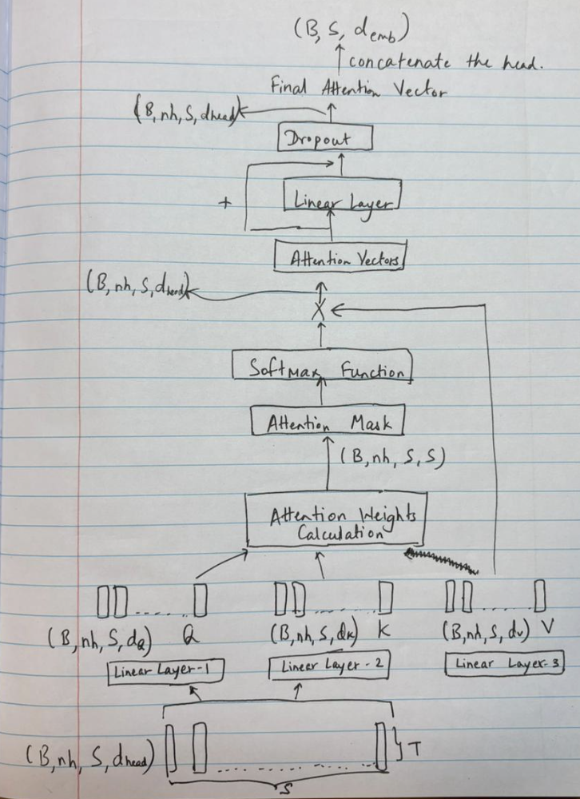
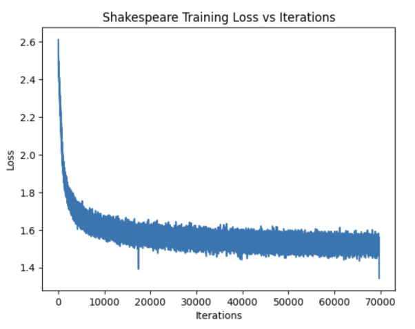
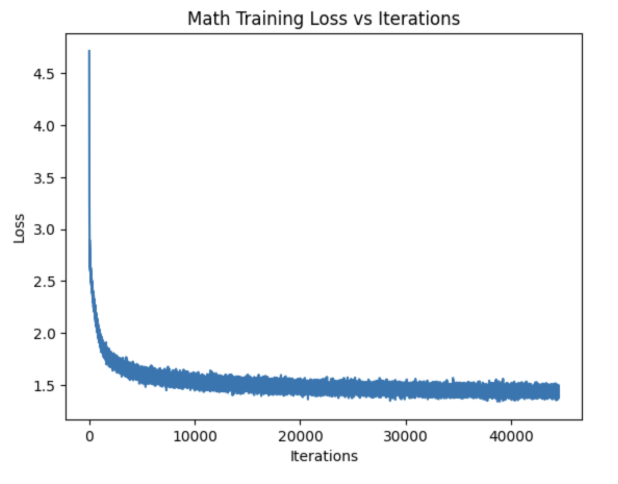
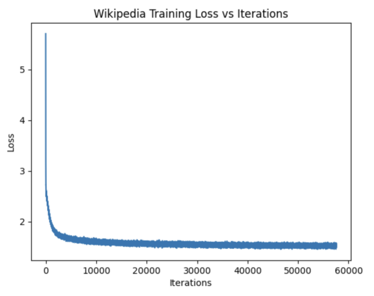

## Part 1 – Training Domain-Specific Models

### Character Frequency Analysis

The datasets (Shakespeare, Math, Wikipedia) differ significantly in terms of character variety and usage. Below is a summary:

| 📚 **Dataset**   | 🔢 **Unique Characters** | 🔠 **Most Frequent Characters** | ✨ **Notable Features** |
|------------------|:-----------------------:|--------------------------------|-------------------------|
| **Shakespeare**  | 65                     | `<space>`, **e**, **t**, **o**, **a** | • Written as plays    • Uses archaic English (e.g., *is’t*, *’tis*)   • No unusual symbols |
| **Math**         | 110                    | `<space>`, **e**, **t**, `\n`, **a** | • Heavy use of numbers & symbols    • Includes: °, ™, ©, ±, ¥, etc.   • Symbols often mark copyright/trademark |
| **Wikipedia**    | 292                    | `<space>`, **e**, **a**, **t**, **o** | • Very diverse characters    • Examples: 万, ش, Æ, ™, ω, 饺   • Modern English, encyclopedic style |

### Model Architecture

The model is built using a transformer-based architecture with **causal self-attention blocks**. The overall structure emphasizes sequence learning and character-level prediction.

### Training Progress and Generated Samples

The models were trained on different corpora, and text was sampled at various iteration checkpoints to track progress.

#### Shakespeare Model
- Early iterations: Random character sequences.
- Around iteration **100**: Spaces introduced between words, though words remained nonsensical.
- By **800–1000 iterations**: Some meaningful words formed.
- By **25,000 iterations onward**: Sentences became more coherent with fewer spelling errors.

#### Math Model
- Initial outputs: Random sequences with heavy use of symbols.
- Slower to learn proper spacing compared to Shakespeare.
- Around **7,500 iterations**: Noticeable improvement, though spelling errors persisted.
- Final model: Proper words and mathematical expressions appeared.

#### Wikipedia Model
- Initial outputs: Random unusual symbols.
- By **3,500 iterations**: Correct word fragments appeared.
- Around **10,500 iterations**: Words became grammatically correct with proper capitalization (e.g., ‘Romania’, ‘Antarctica’).

### Style Differences Across Datasets
- **Shakespeare**: Produces archaic English dialogue with play-like structure.
- **Math**: Focused on mathematical notation and scientific language.
- **Wikipedia**: Informative, modern English with factual tone.

### Repetitiveness in Training
Even after **40,000+ iterations**, the models did **not** show signs of repetitive text or fixed patterns. Outputs remained varied and unique.

### Variability in Outputs
Each model captured the **tone of its corpus**:
- Shakespeare: Characters, dialogues, dramatic tone.
- Math: Mathematical terms, equations, technical writing.
- Wikipedia: Informative content with geographical names and dates.

### Training Loss and Quality
- **Shakespeare**: Coherent outputs began around loss ≈ 1.5–1.6.
- **Math**: Improved around loss ≈ 1.5–1.6 at ~20,000 iterations.
- **Wikipedia**: Required **lower loss (~1.0–1.1)** for convincing outputs.

---

## Part 2 – Cross-Domain Evaluation

### Zero-Shot Evaluation
Cross-entropy loss when evaluating models on other domains:

| 🤖 **Model ↓**   | 📜 **Shakespeare** | 🔢 **Math** | 🌍 **Wikipedia** |
|------------------|:-----------------:|:-----------:|:----------------:|
| **Shakespeare**  | **1.3966**        | 3.9497      | 2.3861           |
| **Math**         | 3.2619            | **1.2258**  | 2.5259           |
| **Wikipedia**    | 2.5144            | 2.7195      | **1.3786**       |

### Few-Shot Evaluation
- Training each model for **200 additional iterations** on a new corpus shows partial adaptation.
- **Math/Wikipedia models** adapted to Shakespeare tone (play-like dialogue) but struggled with word formation.
- **Wikipedia model** picked up mathematical symbols when trained on Math.
- **Shakespeare model** adapted slowly to new domains.

### Early vs. Final Checkpoints
#### Does Partial Training Make Adaptation Easier?

Based on this experiment, it is not entirely clear whether partial training makes adaptation easier. The results from Part 2 Step 2 (final models) and Part 2 Step 3 (earlier checkpoints) showed very similar behaviors, with only slight variations. In both cases, the generated samples attempted to capture the new style of the target corpus (Dataset B), but 200 iterations were not sufficient for the model to fully adapt.

When using the final models in Part 2 Step 2, the outputs already displayed reasonable word formation and had adopted the tone of the original training corpus. However, retraining these models for just 200 iterations on a different corpus with a distinct style likely required more effort, since the weights were already heavily tuned to the original dataset. In contrast, the partially trained models had not yet fully learned the distribution of their original corpus, making it comparatively easier for them to shift towards the new style. This suggests that while partial training may offer more flexibility for cross-domain adaptation, longer training would be necessary in both cases to achieve meaningful results.

---

## Part 3 – Inspecting the Softmax Output Layer
 

**Entropy Trend:**  
The entropy consistently decreases as training progresses, showing that the models become more confident in predicting the next character. As expected, entropy values are higher for out-of-domain prompts than for in-domain ones, reflecting the additional uncertainty when faced with unfamiliar text.  

**Probability Trend:**  
For probabilities, the Shakespeare and Wikipedia models struggled early in training but began predicting the correct next character more reliably after about 3000 iterations. The Math model, on the other hand, learned much faster and assigned high probabilities correctly by around 1000 iterations. However, it often mispredicted `<space>` when given out-of-domain prompts. Across all models, non-target characters quickly dropped to near-zero probability.  

**Where Probabilities Harden:**  
The Shakespeare model showed stable probability assignments after roughly 4000 iterations, while the Math model reached this stage much earlier at around 1000 iterations. The Wikipedia model was slower and still displayed variability even after 14,000 iterations, suggesting that its broader corpus makes convergence less sharp.  

**Where Probabilities Stay Diffuse:**  
In the early stages of training, probabilities remain diffuse because the models are randomly initialized and have not yet learned strong character associations. This effect is also seen with out-of-domain prompts, where the probability distribution stays flatter and less confident.  

**Match to Expectations:**  
Overall, the observed trends matched expectations. Entropy decreased as models improved, and in-domain prompts became more predictable over time. Out-of-domain prompts introduced confusion, producing flatter distributions, which was anticipated. The only exception was with the Math model, which strongly predicted `<space>` instead of the correct next character in one case, a behavior that remains puzzling.  

### Key Observations
- **Entropy decreases** as training progresses → models gain confidence.
- **Out-of-domain prompts** consistently show higher entropy.
- **Shakespeare & Wikipedia models** take ~3,000–4,000 iterations before probabilities harden.
- **Math model** quickly locks into high-confidence predictions but mispredicts `<space>` for out-of-domain prompts.

---

## Part 4 – Gradient-Based Interpretability (Grad-CAM)

**Character Influence:**  
The analysis of gradient norms shows that vowels consistently receive the highest values, followed by consonants and then punctuation marks such as `<space>`. Interestingly, characters from the previous word in the input phrase often exhibit stronger gradients, suggesting that context plays a role in shaping their influence on the prediction.  

**Checkpoint Dynamics:**  
At the beginning of training, the model weights are randomly initialized, which leads to more diffuse influence across characters. As training progresses, the model updates weights to favor characters that are most helpful in predicting the next token. Over time, the model becomes more confident, so the gradient norms shrink toward zero, indicating that fewer adjustments are needed.  

**Domain Differences:**  
The trends differ across domain-specific models. The Wikipedia-trained model relies heavily on alphabets, `<space>`, and `<newline>` tokens, but it also assigns significant gradients to special symbols like `.` and `~` when relevant. This suggests that while alphabets dominate, special characters are also critical when required. In contrast, the Math-trained model depends strongly on digits and special symbols due to the structure of mathematical equations. These observations confirm that models adapt their token importance based on the domain characteristics of their training data.  

**Zero-Shot vs Few-Shot:**  
This part of the analysis was less clear. The expectation was to compare gradient maps between zero-shot and few-shot settings, but the precise interpretation remains uncertain. Additional exploration would be needed to fully understand how examples in the prompt shift token importance.  

**Interpretability Limits:**  
While gradient-based methods provide useful insights, they also have limitations. A high gradient norm does not always indicate that a token is truly important—it simply means the model’s output is sensitive to changes in that token. Large gradients can appear in areas of model uncertainty, which may be misleading. Moreover, gradients in deep models can vanish or explode, complicating interpretation. After training, gradients typically become small because the model is near convergence, but this makes it harder to distinguish which tokens are most influential. Thus, while informative, gradient-based interpretability should be used cautiously and alongside other methods.  

### Insights
- **High gradient norms** usually occur on vowels and frequent consonants, but rare/special characters matter in Math and Wikipedia datasets.
- Over time, gradient influence becomes more **focused** as the model learns.
- **Wikipedia model** emphasizes alphabetic tokens and `<space>`, but adapts to special characters when needed.
- **Math model** relies heavily on digits and symbols for accurate predictions.

---

## Conclusion
The experiments highlight how **training data domain** directly shapes the style and behavior of language models. 
- Shakespeare-trained models mimic archaic English dialogue.
- Math-trained models emphasize mathematical expressions.
- Wikipedia-trained models generate informative, encyclopedic text.

Cross-domain evaluation confirms that while models can adapt, the speed and accuracy of adaptation depend on training progress and dataset characteristics. Interpretability methods like entropy plots and Grad-CAM provide deeper insight into how models learn and focus on different tokens during training.
