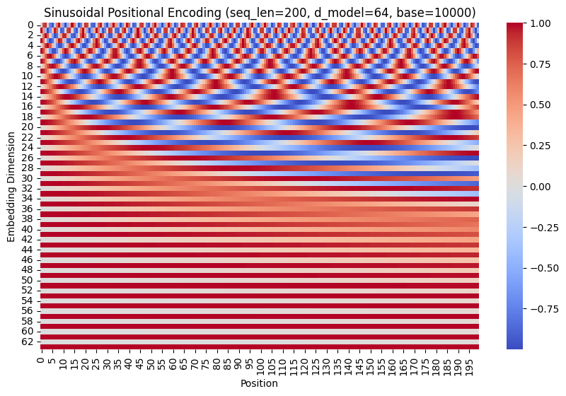
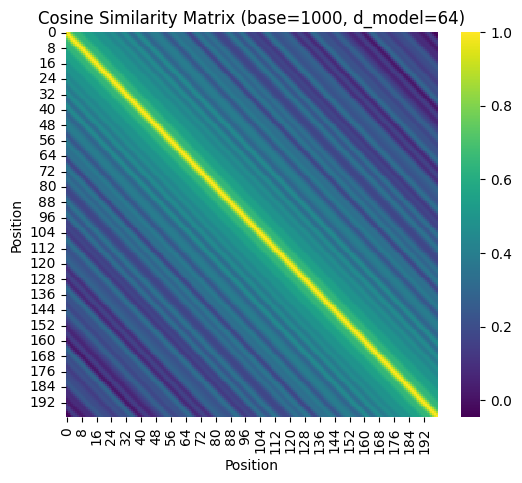
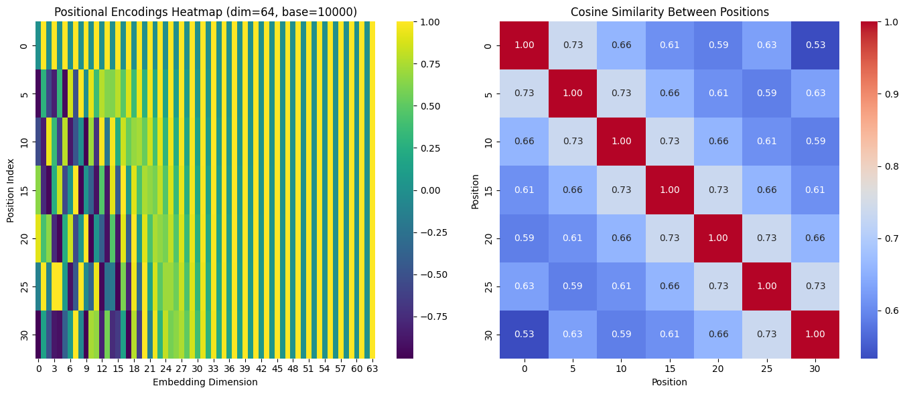
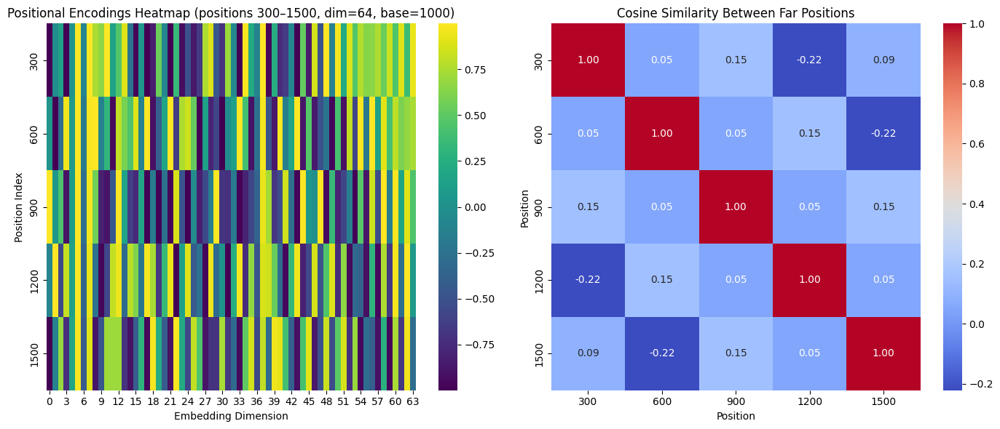
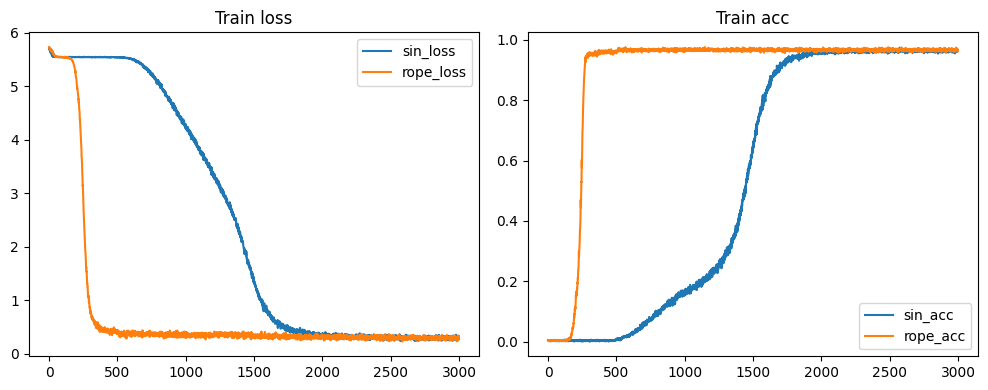
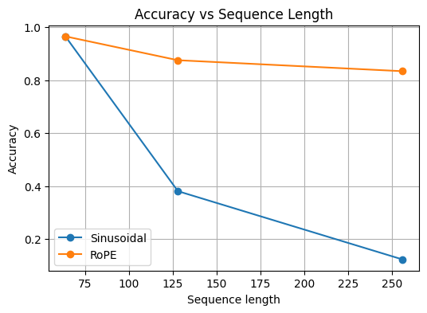

# Positional Embeddings: Sinusoidal vs Rotary (RoPE)

## Introduction

This project compares **Sinusoidal Positional Encodings** and **Rotary Positional Embeddings (RoPE)** in transformer architectures using a **synthetic dataset**. The experiment involves training two small transformers:

1. One using **Sinusoidal positional encoding**.
2. Another using **Rotary Positional Encoding (RoPE)**.

Both models are trained on short sequences and then evaluated on sequences of longer lengths to test their extrapolation ability.

---

## 1. Sinusoidal Experimentation

The sinusoidal positional encoding visualizations reveal how different embedding dimensions capture varying frequency components of positional information.

### Frequency Distribution

In the **first image**, lower-index dimensions correspond to higher-frequency oscillations, encoding fine-grained differences between consecutive tokens. Higher-index dimensions vary more slowly, encoding broader, long-range positional information. This multi-frequency representation allows the transformer to distinguish both local and global positional relationships.

### Positional Similarity

The **second image** shows the cosine similarity matrix between positional embeddings. Tokens close in sequence position exhibit high similarity values (bright diagonal region), while tokens farther apart become increasingly dissimilar (darker regions). This pattern highlights how sinusoidal embeddings emphasize **local continuity** in the sequence.

### Local vs Distant Token Relationships

The **third and fourth images** further confirm this pattern: nearby tokens share high similarity weights, whereas distant tokens have weaker or even negative correlations. Sinusoidal embeddings thus preserve local order well but may struggle with very long-range dependencies, as their periodic nature introduces ambiguity beyond certain sequence lengths.

---

## 2. Training Experiment: Sinusoidal vs RoPE

The core experiment involves training two identical transformer models differing only in their positional encoding method.

* **Dataset:** A synthetic dataset where targets are determined by random positional offsets (local and far dependencies).
* **Goal:** Learn token-to-token positional relationships effectively.
### Task Description
The transformer models were trained on a **synthetic sequence prediction task**.  
For each position *t* in the input sequence, the model predicts the token located *o* positions before it, where the offset *o* is sampled from a mixture of **local** and **far** distance distributions.  
This design encourages the model to learn both **short-range** and **long-range** dependencies, making it an effective setting to evaluate how well different positional encoding schemes (Sinusoidal vs. RoPE) generalize to longer sequences.

### Training Behavior

The **training loss** plot shown in  that the transformer using **RoPE embeddings converges faster**, reaching lower loss earlier compared to the sinusoidal model. Similarly, the **training accuracy** plot indicates that RoPE achieves higher accuracy sooner, suggesting it learns positional dependencies more efficiently.

### Generalization to Longer Sequences

When evaluated on sequence lengths longer than those seen during training, the transformer using **sinusoidal embeddings performs poorly**—its accuracy drops significantly. In contrast, the **RoPE-based transformer** maintains much higher accuracy and demonstrates better generalization to longer contexts. This shows RoPE’s strong ability to **extrapolate beyond the training range**, while sinusoidal embeddings tend to lose positional coherence.

---

### Key Takeaways

* RoPE **reduces training loss faster** and achieves **higher accuracy earlier** than sinusoidal embeddings.
* RoPE **generalizes significantly better** to longer sequences, showing stable performance even beyond the training context.

Overall, **RoPE embeddings demonstrate superior efficiency, stability, and extrapolation ability**, making them a more effective choice for modern transformer models dealing with variable or long-context sequences.
