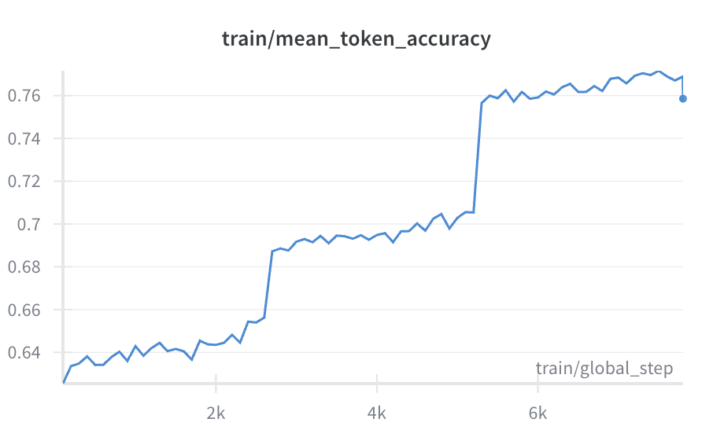

# Supervised Fine-Tuning (SFT) of Pythia-410M on Alpaca Dataset

This repository contains a Jupyter Notebook (`SFT_pythia410m_alpaca.ipynb`) that demonstrates **supervised fine-tuning (SFT)** of the [Pythia 410M](https://huggingface.co/EleutherAI/pythia-410m) language model on the **Alpaca dataset** using Hugging Face’s [TRL](https://github.com/huggingface/trl) library.

---

## 📌 Contents
- **Data loading & preprocessing**: Loads Alpaca-style instruction–response data.
- **Tokenizer setup**: Handles BOS/EOS/PAD tokens and formatting of examples.
- **Training**: Fine-tunes Pythia-410M with Hugging Face `SFTTrainer`.
- **Logging**: Tracks training loss, mean token accuracy, and gradient norm.
- **Evaluation**: Computes perplexity and demonstrates text generation.

---

## ⚙️ Requirements
Install dependencies:
```bash
pip install torch transformers datasets accelerate trl wandb matplotlib
```

---

## 📂 Dataset

The notebook uses the `Alpaca dataset` (instruction–response pairs).
Each example is converted into:
```python
prompt = '''Below is an instruction that describes a task, paired with an input that provides further context. Write a response that appropriately completes the request.

### Instruction:
<INSTRUCTION ABOUT THE TASK>

### Input:
<INPUT ABOUT THE TASK>

### Response:
<RESPONSE OF THE MODEL>
'''
```

---

## 🏋️ Training

Training is handled by `SFTTrainer` with the following key hyperparameters:

num_train_epochs: 3

- `per_device_train_batch_size`: 4

- `gradient_accumulation_steps`: 4

- `learning_rate`: 1e-4

- `fp16/bf16`: mixed precision when GPU supports it

We log during training:

- **Train Loss** → measures how well the model fits the dataset

- **Train Mean Token Accuracy** → fraction of correctly predicted tokens

- **Train Grad Norm** → helps monitor gradient stability

Plots for these metrics are included at the end of the notebook.

---

## 📊 **Results**

- **Loss curve**: Shows steady decrease during training

- **Mean token accuracy**: Improves as model learns

- **Grad norm**: Used to check for exploding/vanishing gradients

You can also compute perplexity and run generation tests with custom prompts.

--- 

## 🤖 **Inference**

After training, you can generate responses with:

```python
prompt = '''Below is an instruction that describes a task, paired with an input that provides further context. Write a response that appropriately completes the request.

### Instruction:
<INSTRUCTION ABOUT THE TASK>

### Input:
<INPUT ABOUT THE TASK>

### Response:
<RESPONSE OF THE MODEL>
'''
print(generate_output(model, tokenizer, prompt))
```

Where generate_output is a helper function provided in the notebook.

---

## ▶️ **Running the Notebook**

Open SFT_pythia410m_alpaca.ipynb in Jupyter or Colab

Run all cells

Monitor training progress via logs and plots

Try inference with custom prompts

---

## 📈 **Visualization**

The following plots are generated during training:

Training loss vs. steps

Mean token accuracy vs. steps

Gradient norm vs. steps

You can embed them like this once saved:





---

## 📎 **References**

- [TRL library](https://github.com/huggingface/trl)  
- [Transformers](https://huggingface.co/docs/transformers)  
- [EleutherAI Pythia models](https://huggingface.co/EleutherAI/pythia-410m)  
- [Alpaca dataset](https://huggingface.co/datasets/tatsu-lab/alpaca)